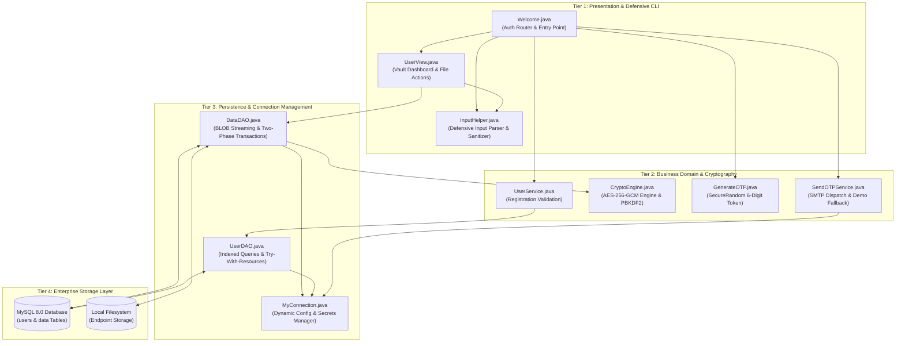
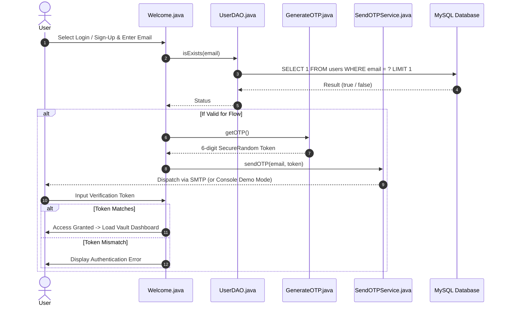
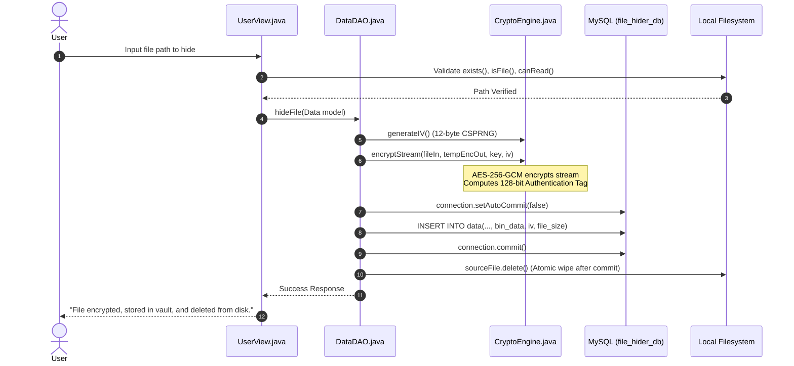
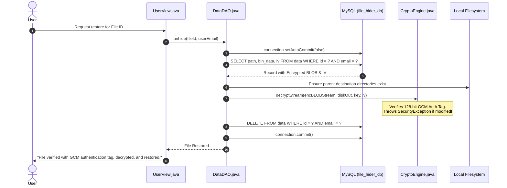
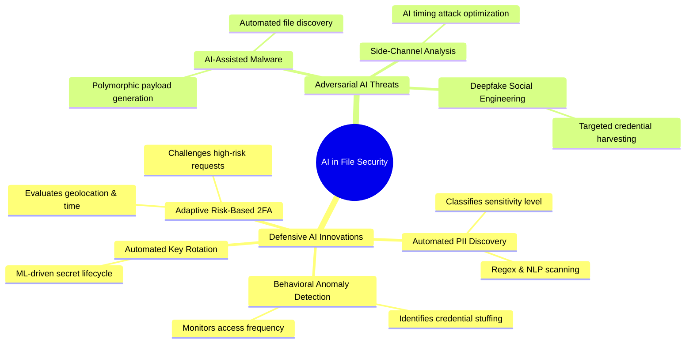

# File Hider Vault — System Architecture, Code Walkthrough, AI Impact & Interview Guide

> **Author:** Sonali Singh — Python Data & Software Engineer  
> **Portfolio:** [sonali763.github.io/portfolio](https://sonali763.github.io/portfolio/)  
> **GitHub:** [github.com/sonali763/File-Hider](https://github.com/sonali763/File-Hider)

---

## Table of Contents
1. [Comprehensive System Architecture](#1-comprehensive-system-architecture)
2. [Codebase Deep-Dive & Component Functionality](#2-codebase-deep-dive--component-functionality)
3. [Real-World Enterprise Use Cases](#3-real-world-enterprise-use-cases)
4. [Impact of Artificial Intelligence (AI) in File Security](#4-impact-of-artificial-intelligence-ai-in-file-security)
5. [Top 15 Technical Interview Questions & High-Scoring Answers (2+ Years Experience)](#5-top-15-technical-interview-questions--high-scoring-answers)

---

# 1. Comprehensive System Architecture

The **File Hider** application employs a **Layered (N-Tier) Architectural Pattern**, strictly separating presentation, business domain logic, cryptographic services, data persistence, and underlying storage engines.



---

## Sequence Flows

### A. Two-Factor Authentication (Registration & Login)


### B. Encrypt & Hide Sequence (Two-Phase Commit)


### C. Decrypt & Restore Sequence (Tamper Verification)


---

# 2. Codebase Deep-Dive & Component Functionality

### 1. `security.CryptoEngine.java`
* **Role:** High-performance cryptographic core.
* **Algorithm:** `AES/GCM/NoPadding` (Advanced Encryption Standard in Galois/Counter Mode).
* **Key Derivation (`deriveKeyFromPassphrase`):** Implements **PBKDF2WithHmacSHA256** across 65,536 iterations combined with a fixed cryptographic salt to derive high-entropy 256-bit symmetric keys from human-readable secrets.
* **Initialization Vector (`generateIV`):** Generates non-repeating 12-byte (96-bit) IVs using `java.security.SecureRandom`. In GCM, IV reuse with the same key breaks confidentiality; our dynamic per-file generation guarantees collision resistance.
* **Streaming Encrypt & Decrypt:** Utilizes `CipherOutputStream` and `CipherInputStream` over 8KB buffers. This ensures files of arbitrary sizes (from text files to multi-gigabyte ISOs) are processed in streaming chunks without loading full payloads into heap memory.

### 2. `dao.DataDAO.java`
* **Role:** Persistent repository for encrypted files.
* **Stream Handling:** Employs `PreparedStatement.setBinaryStream()` and `ResultSet.getBinaryStream()` with MySQL `LONGBLOB` columns, eliminating legacy encoding corruption (`FileReader`/`FileWriter`/`CLOB`).
* **Transactional Integrity:**
  - Invokes `connection.setAutoCommit(false)` before persisting.
  - Commits the encrypted BLOB and metadata to MySQL first.
  - Deletes the original file from the local filesystem **only after** confirmation of commit.
  - Issues `connection.rollback()` if an I/O or database failure occurs, preserving the original file on disk.
* **Authorization Defense:** Every restore and delete operation enforces ownership validation (`WHERE id = ? AND email = ?`), preventing Insecure Direct Object Reference (IDOR) attacks.

### 3. `dao.UserDAO.java`
* **Role:** User account persistence.
* **Optimized Queries:**
  - `isExists()` uses `SELECT 1 FROM users WHERE email = ? LIMIT 1` backed by a database index (`idx_user_email`), converting an $O(N)$ full table scan into an $O(1)$ indexed lookup.
* **Resource Safety:** Uses Java 7+ `try-with-resources` statements across all `Connection`, `PreparedStatement`, and `ResultSet` handles, guaranteeing zero connection leaks.

### 4. `db.MyConnection.java`
* **Role:** Configuration manager and database connection factory.
* **Dynamic Configuration:** Reads from `config.properties` if present, with automatic fallback to environment variables (`DB_URL`, `DB_USERNAME`, `DB_PASSWORD`, `SECURITY_MASTER_KEY`).
* **Master Key Caching:** Derives and caches the `SecretKey` in memory using double-checked synchronization to prevent expensive redundant key derivation operations.

### 5. `service.GenerateOTP.java` & `service.SendOTPService.java`
* **Role:** Two-Factor Authentication (2FA) lifecycle.
* **CSPRNG:** Replaced deterministic `java.util.Random` with `java.security.SecureRandom`, producing cryptographically strong 6-digit tokens (`100000 - 999999`).
* **Resilient Dispatch:** Configurable SMTP settings via TLS/SSL. Features an automated **Console Demo Mode** that outputs the verification token if SMTP credentials are not configured, enabling zero-friction evaluation.

### 6. `views.InputHelper.java`, `Welcome.java` & `UserView.java`
* **Role:** Presentation and user interaction.
* **Crash Proofing:** `InputHelper.readInt()` defensively traps `NumberFormatException`, prompting the user for correction without aborting the JVM.
* **Path Sanitization:** Automatically strips enclosing single or double quotes introduced when users drag and drop files into terminal windows.
* **Corrected Sign-Up Flow:** Checks user existence *prior* to OTP generation, and returns accurate feedback based on database response codes.

---

# 3. Real-World Enterprise Use Cases

### 1. Endpoint Data Loss Prevention (DLP) for Remote Workforces
* **Problem:** Remote employees frequently handle confidential client spreadsheets, source code, and contracts on laptop endpoints that risk physical theft or loss.
* **Solution:** File Hider encrypts sensitive assets at rest into a credential-locked local database, wiping the cleartext files from the OS filesystem. Stolen laptops cannot reveal plaintext data without 2FA and the master cryptographic key.

### 2. Protection of Proprietary Intellectual Property (IP) & Code Repositories
* **Problem:** Proprietary algorithms, model weights, and private configuration keys stored on developer machines are prime targets for endpoint scrapers and malware.
* **Solution:** Developers use File Hider to seal sensitive modules into an encrypted vault during travel or when leaving workstations unattended.

### 3. Defense-in-Depth Against Ransomware
* **Problem:** Ransomware worms (e.g., LockBit) traverse local filesystem directories, searching for known extensions (`.docx`, `.xlsx`, `.pdf`) to encrypt and demand ransom.
* **Solution:** By ingesting files into a binary BLOB database and wiping cleartext extensions from disk, ransomware cannot identify or traverse these hidden documents.

### 4. Regulatory Compliance (GDPR, HIPAA, DPDP, PCI-DSS)
* **Problem:** Regulations mandate that Personally Identifiable Information (PII) and Protected Health Information (PHI) stored on workstations must be encrypted at rest with robust algorithms.
* **Solution:** Utilizing AES-256-GCM satisfies compliance mandates (such as GDPR Article 32 and HIPAA Security Rule §164.312(a)(2)(iv)) for endpoint encryption.

---

# 4. Impact of Artificial Intelligence (AI) in File Security

The intersection of Artificial Intelligence with cybersecurity is reshaping file security, data discovery, and endpoint protection:



### 1. Automated PII Discovery & Intelligent Vault Ingestion (Defensive AI)
* **How It Works:** Integrating lightweight Natural Language Processing (NLP) models (e.g., BERT-based classifiers) or regex-driven LLMs enables the vault to automatically scan files on disk, identify sensitive information (social security numbers, credit card data, API secrets, health records), and automatically recommend or execute vaulting.
* **Value:** Eliminates human error where users forget to manually hide sensitive documents.

### 2. Behavioral Anomaly Detection & Threat Prevention
* **How It Works:** Machine learning models monitor user interaction patterns (e.g., velocity of file unhiding, time of access, frequency of failed OTP attempts).
* **Value:** If an unauthorized script attempts to mass-dump 100 hidden files within 10 seconds, AI behavioral filters immediately lock the vault, notify the security team, and invalidate active session tokens.

### 3. Adaptive Zero-Trust & Context-Aware 2FA
* **How It Works:** AI models analyze metadata (device fingerprint, IP subnet, OS patch level, access time).
* **Value:** If a user logs in from their standard corporate subnet during working hours, a standard OTP is sufficient. If access is attempted from an unusual geographical region or anomalous terminal shell, the system triggers higher-tier verification (e.g., hardware security key challenge).

### 4. Adversarial AI Threats to File Vaults
* **Autonomous Ransomware Agents:** LLM-powered malware can inspect script histories, environment variables, and memory space looking for master key patterns and database connection strings.
* **Countermeasure:** Applications must isolate cryptographic secrets using OS-native secure hardware storage (e.g., Windows DPAPI, macOS Keychain, Linux Secret Service) and enforce memory-zeroing of sensitive cryptographic buffers.

---

# 5. Top 15 Technical Interview Questions & High-Scoring Answers

*(Tailored for a Software Engineer / Data Engineer with 2+ years of experience)*

---

### Q1: Why did you choose AES-256 in GCM mode over CBC or ECB mode?
**Answer:**
> "AES is a symmetric block cipher operating on 128-bit blocks. 
> - **ECB (Electronic Codebook)** is completely insecure because identical plaintext blocks produce identical ciphertext blocks, exposing data patterns.
> - **CBC (Cipher Block Chaining)** provides confidentiality by XORing each plaintext block with the previous ciphertext block. However, CBC does **not** provide data integrity or authenticity. It is vulnerable to chosen-ciphertext attacks such as padding oracle attacks (e.g., POODLE).
> - **GCM (Galois/Counter Mode)** is an **Authenticated Encryption with Associated Data (AEAD)** mode. It combines Counter mode (CTR) for confidentiality with Galois field multiplication to generate a 128-bit authentication tag. This ensures both **confidentiality** and **tamper detection** in a single pass without needing a separate HMAC. If an attacker alters even one bit of the ciphertext in our MySQL database, GCM decryption fails immediately with a verification error."

---

### Q2: Why is IV (Initialization Vector) reuse catastrophic in AES-GCM mode, and how did you prevent it?
**Answer:**
> "In GCM mode, the underlying encryption is Counter (CTR) mode. CTR turns a block cipher into a stream cipher by encrypting sequential counters derived from the IV.
> If two distinct plaintexts ($P_1$ and $P_2$) are encrypted using the **same Key and same IV**, their keystreams ($K$) are identical:
> $$C_1 = P_1 \oplus K, \quad C_2 = P_2 \oplus K$$
> An attacker can simply XOR the two ciphertexts to cancel out the keystream:
> $$C_1 \oplus C_2 = P_1 \oplus P_2$$
> Furthermore, in GCM, IV reuse allows attackers to solve for the internal authentication hash key ($H$), which completely compromises the integrity verification tag.
> **How we prevented it:** We never hardcode or reuse IVs. For every single file hiding operation, [`CryptoEngine.generateIV()`](file:///c:/Users/sonal/OneDrive/Desktop/Sonali_portfolio/File_hider/src/main/java/security/CryptoEngine.java) generates a fresh 96-bit (12-byte) IV using `java.security.SecureRandom`. The unique IV is stored alongside the ciphertext in the database column `iv VARBINARY(16)`."

---

### Q3: How does your application stream multi-gigabyte files into MySQL without running into `OutOfMemoryError`?
**Answer:**
> "If we loaded an entire file into a `byte[]` array or `String` in RAM before encrypting and sending it to MySQL, any file larger than the JVM heap limit (e.g., `-Xmx512m`) would throw an `OutOfMemoryError`.
> We solved this by using **piped stream processing**:
> 1. We wrap file I/O in `FileInputStream` and `FileOutputStream` with chunked 8KB buffers (`byte[8192]`).
> 2. Cryptographic transformation is streamed via `CipherOutputStream` and `CipherInputStream`.
> 3. We use `PreparedStatement.setBinaryStream(index, inputStream, length)` in JDBC. The JDBC driver reads chunks directly from the disk stream and pipes them over the network socket to MySQL without buffering the entire payload in the JVM heap.
> 4. In MySQL, the column is typed as `LONGBLOB` (which supports payloads up to 4 GB), and MySQL's `max_allowed_packet` parameter controls socket chunk size."

---

### Q4: What is the difference between `FileReader`/`FileWriter` and `FileInputStream`/`FileOutputStream`, and why did the original project corrupt non-text files?
**Answer:**
> "`FileReader` and `FileWriter` are character-based stream bridges (`Reader`/`Writer`) designed strictly for textual character data. They automatically apply character decoding and encoding using the JVM's default charset (such as UTF-8 or Windows-1252).
> When arbitrary binary files (like JPEGs, PDFs, ZIP archives, or compiled `.class` files) are read with `FileReader`, binary byte sequences that do not map to valid characters in that charset are replaced with replacement characters (e.g., `\uFFFD` or `?`), and multi-byte encoding corrupts raw bytes.
> Conversely, `FileInputStream` and `FileOutputStream` operate directly on raw 8-bit bytes without any charset interpretation. Switching to binary byte streams guarantees 100% byte-for-byte fidelity for all file types."

---

### Q5: How did you implement ACID transactional integrity to prevent file loss if a crash occurs during encryption?
**Answer:**
> "In an endpoint security app, deleting the original file before database insertion confirms success could lead to permanent data loss if a network failure or SQL exception occurs.
> We implemented a strict **two-phase commit workflow**:
> 1. Disable auto-commit on the JDBC connection (`connection.setAutoCommit(false)`).
> 2. Encrypt the file stream into an encrypted temporary file.
> 3. Execute the `INSERT` statement into the `data` table with the binary stream.
> 4. Commit the transaction (`connection.commit()`).
> 5. **Only after** the database commit succeeds do we invoke `sourceFile.delete()` on the local disk.
> 6. If any exception is thrown prior to commit, `connection.rollback()` is executed in the `catch` block, the temporary file is deleted, and the original file remains completely untouched on disk."

---

### Q6: Why is `java.util.Random` considered a security vulnerability for generating OTPs, and how does `SecureRandom` differ?
**Answer:**
> "`java.util.Random` is a **Linear Congruential Generator (LCG)**. It has a state size of only 48 bits and is completely deterministic. If an attacker observes two or three consecutive 4-digit OTPs generated by `Random`, they can mathematically reconstruct the internal seed and predict all past and future OTPs.
> In contrast, `java.security.SecureRandom` is a **Cryptographically Secure Pseudo-Random Number Generator (CSPRNG)**. It complies with FIPS 140-2 requirements by collecting high-entropy physical noise from the operating system (e.g., `/dev/urandom` on Linux, `CryptGenRandom` on Windows, hardware interrupts, and timing jitter). Its internal state is cryptographically non-invertible, making OTP prediction computationally infeasible."

---

### Q7: Explain the difference between $O(N)$ and $O(1)$ lookups in database interaction and how you fixed `UserDAO.isExists`.
**Answer:**
> "The original code executed `SELECT email FROM users;` and looped through all returned rows in Java with `while(rs.next()) { if(rs.getString(1).equals(email)) ... }`.
> This is an anti-pattern because:
> 1. It pulls the **entire table over the network** into application memory ($O(N)$ network transfer and heap consumption).
> 2. It wastes database server CPU cycles.
> 
> We optimized this to:
> ```sql
> SELECT 1 FROM users WHERE email = ? LIMIT 1;
> ```
> With a database index on the `email` column (`idx_user_email`), the MySQL query optimizer performs a B-Tree index seek in $O(\log N)$ or $O(1)$ time, returns at most a single byte over the wire, and halts immediately upon finding the first match."

---

### Q8: How does Java 7+ `try-with-resources` work, and what problems does it eliminate?
**Answer:**
> "`try-with-resources` requires any object declared within the parentheses to implement `java.lang.AutoCloseable`.
> Prior to Java 7, developers had to nest multiple `finally` blocks to close `ResultSet`, `Statement`, and `Connection` individually. A failure in closing one handle could bypass closing the subsequent handles, resulting in leaked database connection pools and file descriptor leaks.
> With `try-with-resources`, the Java compiler automatically synthesizes cleanup code with suppressed exception handling. Regardless of whether a method exits normally or throws a checked/runtime exception, every declared resource is closed in the reverse order of its creation."

---

### Q9: How is the master encryption key derived, and why use PBKDF2 with salt instead of plain SHA-256?
**Answer:**
> "If a user chooses a human-readable password (e.g., `SecretPass123`), taking a single SHA-256 hash yields a predictable 256-bit key. Attackers with modern GPUs can compute billions of SHA-256 hashes per second using precomputed rainbow tables or dictionary attacks.
> To prevent this, we use **PBKDF2WithHmacSHA256 (Password-Based Key Derivation Function 2)**:
> 1. **Salt:** We inject a non-predictable cryptographic salt. This ensures that even if two users have identical passphrases, their derived keys are completely different, rendering rainbow tables useless.
> 2. **Key Stretching:** We iterate the hashing function 65,536 times. This deliberate computational cost makes brute-force dictionary attacks prohibitively expensive for attackers while taking only milliseconds on the legitimate user's CPU."

---

### Q10: How does this codebase prevent SQL Injection vulnerabilities?
**Answer:**
> "SQL Injection occurs when user-supplied input is directly concatenated into SQL statement strings (`"SELECT * FROM users WHERE email = '" + email + "'"`). Attackers can input `' OR '1'='1` to bypass authentication or drop tables.
> In our application, **100% of database interactions utilize parameterized `PreparedStatement` objects**. Parameter values are sent separately from the SQL statement template via the database binary protocol. The MySQL parser treats all user input strictly as literal data, never as executable SQL code."

---

### Q11: If an attacker steals the raw database dump (`.sql` file) containing all rows in the `data` table, what can they access?
**Answer:**
> "The attacker can see the user email, the original file name, the file size, and the creation timestamp.
> However, they **cannot read or reconstruct any file contents**. The `bin_data` column contains ciphertext encrypted with AES-256-GCM, which has an effective security strength of 256 bits (requiring $2^{256}$ operations to brute-force). Without the master encryption key (which is kept out of Git and out of the database in external environment variables/configuration), the payload is indistinguishable from random noise."

---

### Q12: Why should database credentials and SMTP keys never be stored in Git, and how did you externalize configuration?
**Answer:**
> "Committing credentials to Git exposes them to everyone with repository read access and risks accidental leakage via public forks or compromised developer workstations. Automated GitHub bots actively scrape commits for exposed AWS, database, and email passwords.
> We implemented a 12-Factor App methodology:
> 1. We created `.gitignore` to strictly exclude `config.properties` and `.env` files.
> 2. We committed `config.properties.example` containing placeholder templates.
> 3. In [`MyConnection.java`](file:///c:/Users/sonal/OneDrive/Desktop/Sonali_portfolio/File_hider/src/main/java/db/MyConnection.java), we load properties with environment variable fallbacks (`System.getenv()`), allowing seamless configuration injection in Docker containers and CI/CD production pipelines without modifying code."

---

### Q13: At higher concurrency, what architectural upgrades would you introduce to this database persistence layer?
**Answer:**
> "In the current version, [`MyConnection.getConnection()`](file:///c:/Users/sonal/OneDrive/Desktop/Sonali_portfolio/File_hider/src/main/java/db/MyConnection.java) calls `DriverManager.getConnection()`, which initiates a new TCP handshake and MySQL authentication cycle for each query.
> For production scale:
> 1. **Connection Pooling:** Introduce **HikariCP**, the industry-standard high-performance JDBC connection pool. HikariCP keeps a pool of warm database connections alive, reducing query latency from ~50ms to <1ms.
> 2. **Object-Relational Mapping (ORM):** Migrate to **Spring Data JPA / Hibernate** with entity lifecycle management and optimistic locking (`@Version`).
> 3. **Chunked Storage / S3 Offloading:** For enterprise workloads with terabyte-scale files, rather than storing multi-gigabyte BLOBs in MySQL, store encrypted payloads in an S3-compatible object store (e.g., AWS S3 or GCP Cloud Storage) and store only the object URI, IV, and hash metadata in MySQL."

---

### Q14: How does AI change the threat model for file encryption and endpoint vaults?
**Answer:**
> "AI impacts the threat landscape in two contrasting ways:
> - **Offensive Threats:** Attackers use generative AI models to craft polymorphic ransomware that dynamically evades signature-based antivirus. Attackers also use automated LLM agents to scan developer filesystems, bash histories, and environment variables looking for encryption passphrases.
> - **Defensive Opportunities:** We can deploy localized machine learning models to classify data sensitivity (identifying PII/PHI in real time) and detect anomalous vault interaction patterns (e.g., an unusual spike in file unhiding triggered at 3 AM). Furthermore, AI models can assist in zero-trust adaptive authentication, challenging users with stepped-up 2FA when anomalous device attributes are detected."

---

### Q15: What happens if an attacker tampers with an encrypted file in the database (e.g., flips a single bit in `bin_data`)?
**Answer:**
> "Because we use **AES-256 in GCM (Galois/Counter Mode)**, the cipher calculates an internal 128-bit authentication tag over the ciphertext and Initialization Vector during encryption.
> During restoration in [`DataDAO.unhide()`](file:///c:/Users/sonal/OneDrive/Desktop/Sonali_portfolio/File_hider/src/main/java/dao/DataDAO.java):
> 1. `CryptoEngine.decryptStream()` passes the ciphertext and tag to `CipherInputStream`.
> 2. If a single bit in the ciphertext or IV has been modified, the recalculated GMAC tag will not match the embedded authentication tag.
> 3. The underlying cryptographic provider throws an `AEADBadTagException` (wrapped in a `SecurityException`).
> 4. Our application catches this exception, immediately rolls back the database transaction, removes any partially written destination file on disk, and alerts the user that **tampering was detected**."

---

## 📌 Summary for Recruiters & Hiring Managers

This project demonstrates:
- **Core Java Competence (Java 17):** Streams, Collections, Custom Exception Handling, Clean Architecture, and Defensive Programming.
- **Enterprise Security & Cryptography:** NIST SP 800-38D AES-256-GCM, PBKDF2WithHmacSHA256, CSPRNGs, and Two-Factor Authentication.
- **Database Engineering (MySQL & JDBC):** PreparedStatements, Indexed Lookups, BLOB Streaming, and ACID Transactional Integrity.
- **Production Hygiene:** Git Best Practices, Secrets Segregation, and Maven Build Automation.
