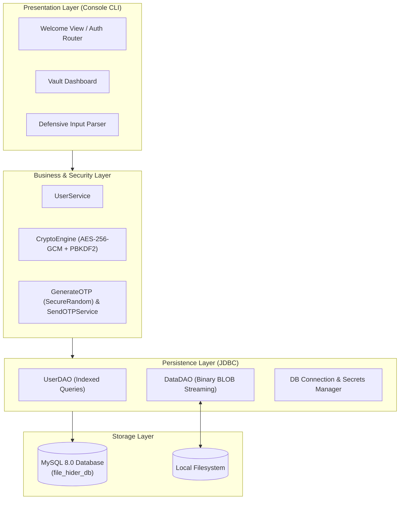

# File Hider — Enterprise Security & Cryptographic Vault

[](https://www.oracle.com/java/)
[](https://csrc.nist.gov/publications/detail/sp/800-38d/final)
[](https://www.mysql.com/)
[](https://maven.apache.org/)
[](https://en.wikipedia.org/wiki/Multi-factor_authentication)

An enterprise-grade Java security application engineered to protect sensitive data on local machines through **authenticated AES-256-GCM encryption**, **relational BLOB storage**, and **Two-Factor Authentication (2FA)**.

Featured on [Sonali Singh's Portfolio](https://sonali763.github.io/portfolio/).

📖 **Full Technical Deep-Dive & Interview Guide:** [`ARCHITECTURE_AND_INTERVIEW_GUIDE.md`](ARCHITECTURE_AND_INTERVIEW_GUIDE.md)  
*Includes exhaustive N-tier architecture diagrams, code breakdown, enterprise use cases, AI impact analysis, and Top 15 technical interview questions with comprehensive answers.*

---

## 🎯 Executive Summary & Problem Statement

Unprotected files residing on personal or corporate workstations are vulnerable to unauthorized physical inspection, credential theft, and ransomware scraping. Standard OS file-hiding utilities simply toggle filesystem attributes (e.g., hidden flags), which can be circumvented trivially in seconds.

**File Hider** solves this by providing:
1. **True Cryptographic Encryption at Rest:** Files are encrypted using authenticated **AES-256 in Galois/Counter Mode (GCM)** with a unique, cryptographically random Initialization Vector (IV) per file.
2. **Atomic Transactional Storage:** Encrypted payloads are streamed directly into a MySQL `LONGBLOB` database. The unencrypted local file is securely wiped from disk **only after** the database commit successfully finishes.
3. **Tamper Detection & Authenticity:** When restoring files, the GCM 128-bit authentication tag guarantees that the ciphertext was not modified or corrupted.
4. **Multi-Factor Authentication (MFA/2FA):** User login and account registration require cryptographically generated 6-digit one-time passcodes (OTP).

---

## 🏛️ System Architecture



---

## 🔒 Cryptographic & Security Engineering Details

### 1. Authenticated Symmetric Encryption (AES-256-GCM)
- **Algorithm:** AES (Advanced Encryption Standard) with 256-bit key length.
- **Mode of Operation:** GCM (Galois/Counter Mode), providing both **confidentiality** and **built-in data authenticity**.
- **Initialization Vector (IV):** A distinct 96-bit (12-byte) IV is generated for every single file using `java.security.SecureRandom`. Reusing IVs is strictly prevented.
- **Key Derivation:** Master keys are derived using **PBKDF2 with HMAC-SHA256** across 65,536 iterations with cryptographic salt.

### 2. Zero-Loss Binary Streaming (BLOBs)
Unlike simple implementations that treat files as character streams (`FileReader`/`CLOB`) which corrupt binary formats (PDFs, images, ZIPs, executables), File Hider utilizes:
- `InputStream` / `OutputStream` binary pipes.
- Database storage via `PreparedStatement.setBinaryStream()` into `LONGBLOB`.
- Chunked 8KB buffer streaming to handle large files without heap memory spikes.

### 3. ACID Transactional Integrity & Rollback Protection
Hiding a file follows a strict two-phase atomic commit:
1. **Encrypt & Persist:** File is encrypted and inserted into the database within an open transaction (`setAutoCommit(false)`).
2. **Commit:** The database transaction is committed.
3. **Disk Wipe:** Original file on disk is removed **only after** step 2 completes.
4. If an error occurs at any point, the transaction is **rolled back**, and the original file is left safely intact on disk.

---

## 🗄️ Database Schema

The database architecture is designed with foreign key constraints, UTF8mb4 encoding, and indexed query paths:

```sql
-- Users Table
CREATE TABLE users (
    id INT AUTO_INCREMENT PRIMARY KEY,
    name VARCHAR(100) NOT NULL,
    email VARCHAR(150) NOT NULL UNIQUE,
    created_at TIMESTAMP DEFAULT CURRENT_TIMESTAMP,
    INDEX idx_user_email (email)
);

-- Encrypted Files Table
CREATE TABLE data (
    id INT AUTO_INCREMENT PRIMARY KEY,
    name VARCHAR(255) NOT NULL COMMENT 'Original file name',
    path TEXT NOT NULL COMMENT 'Original absolute filesystem path',
    email VARCHAR(150) NOT NULL COMMENT 'Owner user email',
    bin_data LONGBLOB NOT NULL COMMENT 'AES-256-GCM encrypted binary file payload',
    iv VARBINARY(16) NOT NULL COMMENT '12-byte GCM initialization vector',
    file_size BIGINT DEFAULT 0 COMMENT 'Original file size in bytes',
    created_at TIMESTAMP DEFAULT CURRENT_TIMESTAMP,
    INDEX idx_data_email (email),
    CONSTRAINT fk_data_user_email FOREIGN KEY (email) REFERENCES users (email) ON DELETE CASCADE
);
```

---

## 🚀 Quick Start Guide

### Prerequisites
- **Java Development Kit (JDK):** Version 17 or higher
- **Apache Maven:** 3.8+
- **MySQL Server:** 8.0+

### Step 1: Clone Repository
```bash
git clone https://github.com/sonali763/File-Hider.git
cd File-Hider
```

### Step 2: Set Up MySQL Database
Log in to MySQL and execute the provided `schema.sql` script:
```bash
mysql -u root -p < schema.sql
```

### Step 3: Configure Application
Copy the configuration template:
```bash
cp config.properties.example config.properties
```
Edit `config.properties` to set your MySQL credentials and master key:
```properties
db.url=jdbc:mysql://localhost:3306/file_hider_db?useSSL=false&allowPublicKeyRetrieval=true&serverTimezone=UTC
db.username=root
db.password=your_mysql_password

security.master_key=YourSuperSecretMasterKey32Chars!
```

> **Note on OTP/2FA:** If SMTP mail credentials are left empty, the application automatically activates **Demo Mode**, displaying the generated 6-digit verification code directly in your console for seamless testing and demonstration!

### Step 4: Build & Run
Using Maven:
```bash
mvn clean package
java -jar target/file-hider-1.0.0.jar
```
Or directly through an IDE like IntelliJ IDEA / Eclipse by executing `src/main/java/Main.java`.

---

## 💻 Console Interface Walkthrough

```text
========================================================
       FILE HIDER - ENTERPRISE SECURITY VAULT           
  Confidentiality • Authenticated AES-256-GCM • 2FA     
========================================================
  1. Login with 2FA OTP
  2. Create a New Account
  0. Exit Application
========================================================
Select an option [0-2]: 1

--- USER LOGIN ---
Enter your registered email: sonali0singh27@gmail.com
------------------------------------------------------------
[DEMO MODE] SMTP credentials not configured in config.properties.
>> Verification Code for [sonali0singh27@gmail.com]: 849201
------------------------------------------------------------
Enter the 6-digit verification code: 849201
[✓] Authentication successful! Loading your vault...

--------------------------------------------------------
 VAULT DASHBOARD | User: sonali0singh27@gmail.com
--------------------------------------------------------
  1. List All Hidden & Encrypted Files
  2. Encrypt and Hide a File
  3. Decrypt and Restore a File
  4. Logout (Return to Main Menu)
  0. Exit Application
--------------------------------------------------------
```

---

## 📊 Key Engineering Improvements (Before vs After)

| Feature / Area | Initial Codebase | Refactored Enterprise Edition |
| :--- | :--- | :--- |
| **Cryptography** | Plaintext SQL storage (no cipher) | **Authenticated AES-256-GCM** with 12-byte random IVs |
| **Binary File Support** | Corrupted binaries (`FileReader`/`CLOB`) | **Zero-loss `LONGBLOB` byte streams** (PDFs, Images, ZIPs) |
| **Integrity & Rollback** | Deleted files prematurely | **Two-phase commit transactions** with rollbacks |
| **Database Queries** | Full table scan in Java ($O(N)$) | **Indexed queries** (`SELECT 1 ... LIMIT 1`) |
| **Resource Management** | Unclosed Connections, PS, and RS | Strict **`try-with-resources`** (zero connection leaks) |
| **OTP Security** | Insecure `java.util.Random` (4 digits) | **`SecureRandom`** 6-digit token with demo fallback |
| **Input Robustness** | Crashed on letters (`NumberFormatException`) | **Defensive input parsing** with automated retry loop |
| **Git Hygiene** | Tracked `target/` binaries and `.idea/` | Clean **`.gitignore`**, zero secrets, modular configs |

---

## 📚 Technical Architecture, Code Guide & Interview Q&A

For an in-depth exploration of the engineering principles, threat models, and architectural decisions behind this application, check out the dedicated technical guide:

👉 **[Read the Full System Architecture, Code Guide & Interview Q&A Document](ARCHITECTURE_AND_INTERVIEW_GUIDE.md)**

### Included in the Guide:
1. **Full Architectural Design & Diagrams:** Detailed N-Tier component breakdown and Mermaid sequence diagrams for Authentication, File Encryption, and Decryption.
2. **Codebase Deep-Dive:** Exhaustive functional explanations of `CryptoEngine.java`, `DataDAO.java`, `UserDAO.java`, `MyConnection.java`, `InputHelper.java`, and services.
3. **Enterprise Use Cases:** Remote endpoint Data Loss Prevention (DLP), proprietary code sealing, ransomware defense, and regulatory compliance (GDPR/HIPAA).
4. **Impact of AI in File Security:** Automated PII discovery, behavioral anomaly detection, adaptive zero-trust 2FA, and threat vectors from autonomous AI malware.
5. **Top 15 Technical Interview Questions & High-Scoring Answers:** Comprehensive explanations covering AES-GCM vs CBC, IV collision math, multi-GB streaming BLOBs, CSPRNG mechanics, and ACID transaction rollbacks.

---

## 👤 Author & Contact

**Sonali Singh** — Python Data & Software Engineer  
- 🌐 **Portfolio:** [sonali763.github.io/portfolio](https://sonali763.github.io/portfolio/)  
- 💼 **LinkedIn:** [linkedin.com/in/sonali-singh73](https://linkedin.com/in/sonali-singh73)  
- 🐙 **GitHub:** [github.com/sonali763](https://github.com/sonali763)  
- 📧 **Email:** [sonali0singh27@gmail.com](mailto:sonali0singh27@gmail.com)
